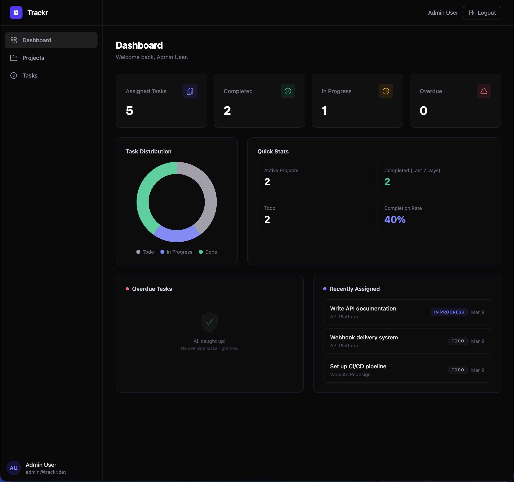
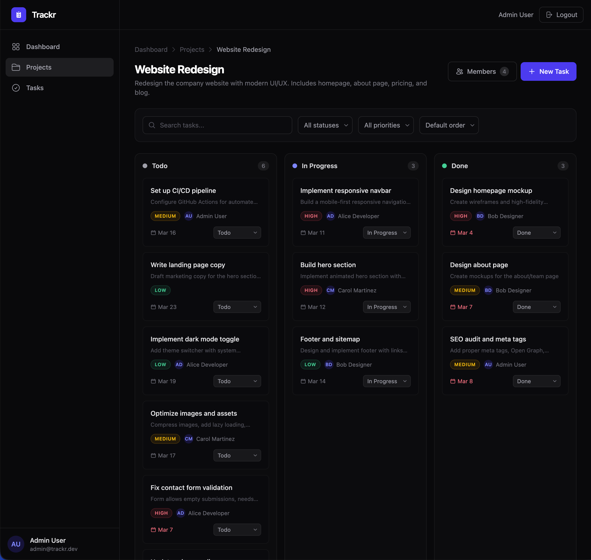
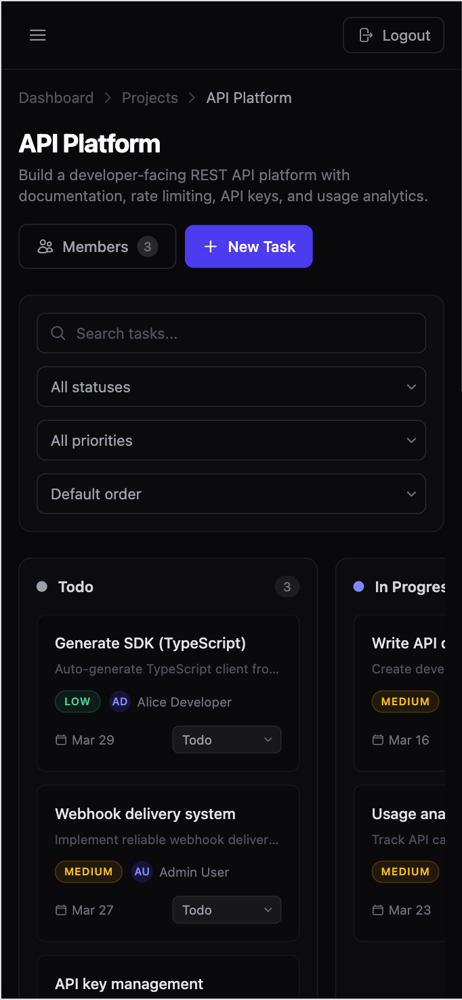

# Trackr

A full-stack project management application with Kanban boards, team collaboration, and real-time task tracking. Built with Angular and Spring Boot.

> **Live Demo:** [https://trackr-app.vercel.app](https://trackr-app.vercel.app) · **API:** [https://trackr-api.railway.app](https://trackr-api.railway.app)

*(Update these URLs once deployed)*



---

## About

Trackr helps teams organize projects and track tasks through an intuitive Kanban-style interface. Users can create projects, invite team members, assign tasks with priorities and deadlines, and visualize progress through a dashboard with real-time metrics.

### Key Features

- **Authentication** — Register and login with JWT-based auth (access + refresh tokens). Sessions persist securely without re-login.
- **Project Management** — Create projects, invite members by email, and manage team access with owner/member roles.
- **Kanban Board** — Drag-and-drop tasks between columns (To Do → In Progress → Done). Visual indicators for priority and deadlines.
- **Task Filtering** — Search, filter by status/priority/assignee, and sort by date or priority. All server-side for performance.
- **Dashboard** — Overview of tasks by status, overdue items, recent activity, and a productivity chart for the last 7 days.
- **Responsive Design** — Fully usable on desktop, tablet, and mobile. Collapsible sidebar and horizontal-scroll Kanban on small screens.

---

## Tech Stack

| Layer | Technology | Why |
|-------|-----------|-----|
| Frontend | Angular 21 (LTS), TypeScript 5.9, Tailwind CSS 4 | Component architecture, strong typing, utility-first styling |
| Backend | Java 17+, Spring Boot 3, Spring Security | Industry-standard enterprise framework with robust security |
| Database | PostgreSQL | Relational data with complex relationships (users ↔ projects ↔ tasks) |
| Auth | Spring Security + JWT | Stateless auth with access/refresh token rotation |
| DevOps | Docker, Docker Compose | Consistent dev environment, one-command setup |
| Deploy | Vercel (frontend), Railway (backend + DB) | Zero-config deploys with free tier |

---

## Architecture

```
┌─────────────────┐         ┌──────────────────────┐         ┌────────────┐
│                 │  HTTP   │                      │   JPA   │            │
│  Angular SPA    │────────▶│  Spring Boot API     │────────▶│ PostgreSQL │
│  (Vercel)       │◀────────│  (Railway)           │◀────────│ (Railway)  │
│                 │  JSON   │                      │         │            │
└─────────────────┘         └──────────────────────┘         └────────────┘
                                     │
                            ┌────────┴────────┐
                            │  Spring Security │
                            │  JWT Filter      │
                            └─────────────────┘
```

### Project Structure

```
trackr/
├── backend/
│   ├── src/main/java/com/trackr/
│   │   ├── config/          # Security, CORS, JWT configuration
│   │   ├── controller/      # REST controllers
│   │   ├── dto/             # Request/response objects
│   │   ├── exception/       # Global exception handling
│   │   ├── model/           # JPA entities
│   │   ├── repository/      # Spring Data repositories
│   │   └── service/         # Business logic
│   ├── src/main/resources/
│   │   ├── application.yml
│   │   └── application-prod.yml
│   ├── Dockerfile
│   └── pom.xml
├── frontend/
│   ├── src/app/
│   │   ├── auth/            # Login, register, guards, interceptors
│   │   ├── core/            # Shared services, models, interceptors
│   │   ├── dashboard/       # Dashboard with charts and metrics
│   │   ├── projects/        # Project list and detail views
│   │   ├── tasks/           # Task board, task forms, drag & drop
│   │   └── shared/          # Reusable UI components
│   ├── src/environments/
│   ├── Dockerfile
│   ├── nginx.conf           # Nginx config for SPA routing (production)
│   └── angular.json
├── docker-compose.yml        # Dev environment (all services)
├── docker-compose.prod.yml   # Production build
├── .env.example              # Environment variables template
└── README.md
```

---

## Data Model

```
┌──────────┐       ┌──────────────────┐       ┌──────────┐
│  User    │──────▶│ project_members  │◀──────│ Project  │
│          │  M:N  │ (user_id,        │  M:N  │          │
│ id       │       │  project_id,     │       │ id       │
│ email    │       │  role)           │       │ name     │
│ password │       └──────────────────┘       │ owner_id │
│ name     │                                  └─────┬────┘
└─────┬────┘                                        │
      │                                             │ 1:N
      │ assigned_to                                 │
      │                                       ┌─────┴────┐
      └──────────────────────────────────────▶│  Task    │
                                        N:1   │          │
                                              │ id       │
                                              │ title    │
                                              │ status   │
                                              │ priority │
                                              │ due_date │
                                              └──────────┘
```

---

## Getting Started

### Prerequisites

- [Docker](https://docs.docker.com/get-docker/) and Docker Compose
- Node.js 24 LTS (Krypton) — only needed for local development outside Docker (`.nvmrc` included, use `nvm use`)

That's it for Docker. No need to install Java, Node.js, or PostgreSQL locally.

### 1. Clone the repository

```bash
git clone https://github.com/yourusername/trackr.git
cd trackr
```

### 2. Configure environment

```bash
cp .env.example .env
# Edit .env with your preferred values (defaults work out of the box)
```

### 3. Start all services

```bash
docker compose up
```

This starts three containers:

| Service | URL | Description |
|---------|-----|-------------|
| **Frontend** | `http://localhost:4200` | Angular dev server with hot reload |
| **Backend** | `http://localhost:8080` | Spring Boot API with hot reload (Spring DevTools) |
| **Database** | `localhost:5432` | PostgreSQL 15 |

### 4. Stop services

```bash
docker compose down          # Stop containers
docker compose down -v       # Stop and remove database volume (reset data)
```

### Useful Commands

```bash
# Rebuild after dependency changes (pom.xml or package.json)
docker compose up --build

# View logs for a specific service
docker compose logs -f backend
docker compose logs -f frontend

# Run Angular CLI commands inside the container
docker compose exec frontend ng generate component my-component

# Run Maven commands inside the container
docker compose exec backend ./mvnw test

# Access PostgreSQL directly
docker compose exec db psql -U trackr -d trackr
```

### Environment Variables (`.env`)

| Variable | Description | Default |
|----------|------------|---------|
| `POSTGRES_DB` | Database name | `trackr` |
| `POSTGRES_USER` | Database user | `trackr` |
| `POSTGRES_PASSWORD` | Database password | `trackr_dev` |
| `JWT_SECRET` | Secret key for signing JWTs | `your-256-bit-secret-change-in-production` |
| `JWT_ACCESS_EXPIRATION` | Access token TTL in ms | `900000` (15 min) |
| `JWT_REFRESH_EXPIRATION` | Refresh token TTL in ms | `604800000` (7 days) |

### Production Build

```bash
docker compose -f docker-compose.prod.yml up --build
```

This builds optimized images: Angular compiled and served via Nginx, Spring Boot as a slim JAR, both behind their respective containers.

---

## API Endpoints

| Method | Endpoint | Description | Auth |
|--------|---------|-------------|------|
| POST | `/api/auth/register` | Register a new user | No |
| POST | `/api/auth/login` | Login and receive tokens | No |
| POST | `/api/auth/refresh` | Refresh access token | No |
| GET | `/api/projects` | List user's projects | Yes |
| POST | `/api/projects` | Create a project | Yes |
| GET | `/api/projects/:id` | Get project details | Yes |
| PUT | `/api/projects/:id` | Update a project | Owner |
| DELETE | `/api/projects/:id` | Delete a project | Owner |
| POST | `/api/projects/:id/members` | Add a member | Owner |
| DELETE | `/api/projects/:id/members/:userId` | Remove a member | Owner |
| GET | `/api/projects/:id/tasks` | List tasks (with filters) | Member |
| POST | `/api/projects/:id/tasks` | Create a task | Member |
| PUT | `/api/tasks/:id` | Update a task | Member |
| PATCH | `/api/tasks/:id/status` | Change task status | Member |
| DELETE | `/api/tasks/:id` | Delete a task | Member |
| GET | `/api/dashboard` | Get dashboard metrics | Yes |

---

## Screenshots

| Dashboard | Kanban Board |
|-----------|-------------|
|  |  |

| Task Detail | Mobile View |
|-------------|-------------|
|  |  |

*(Add screenshots to `docs/screenshots/` once the UI is built)*

---

## Technical Decisions

- **Fully Dockerized development** — The entire stack runs in containers via Docker Compose. No local Java, Node.js, or PostgreSQL installation needed. Source code is mounted as volumes so changes reflect immediately with hot reload on both frontend and backend.

- **JWT with refresh tokens** — Access tokens expire in 15 minutes for security. Refresh tokens (7-day TTL) allow seamless re-authentication without forcing re-login. The Angular interceptor handles token refresh transparently.

- **Server-side filtering** — All task filtering, sorting, and search happens via query parameters processed by Spring Data Specifications. This keeps the frontend lightweight and performs well as data grows.

- **DTOs over entities** — API responses use dedicated DTO classes instead of exposing JPA entities directly. This prevents circular serialization issues, controls what data is exposed, and decouples the API contract from the database schema.

- **Monorepo structure** — Both frontend and backend live in one repository for easier development, consistent versioning, and simpler CI/CD setup.

---

## License

This project is for portfolio and educational purposes.