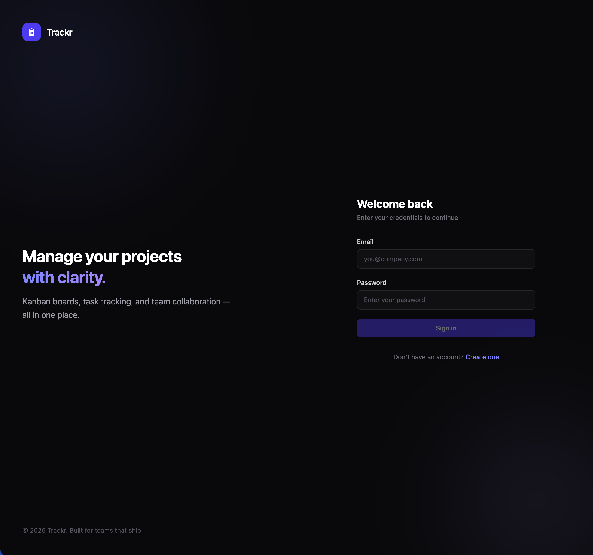
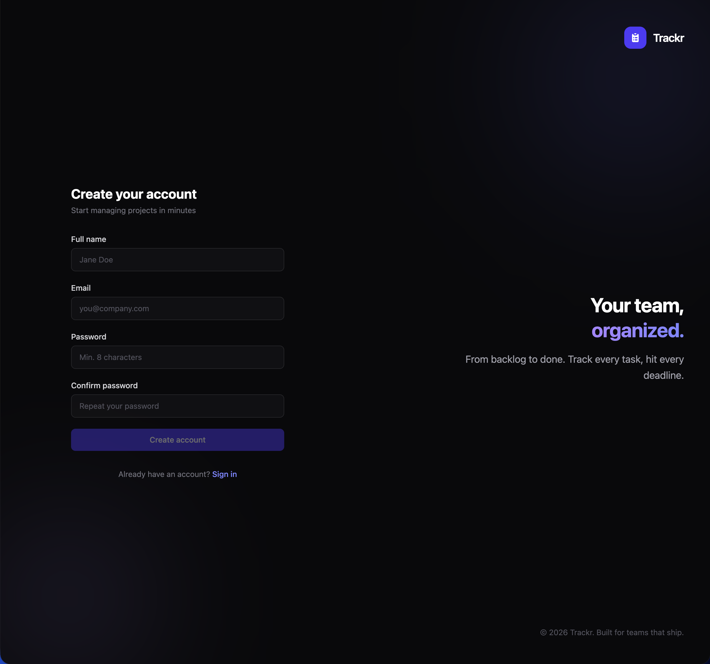
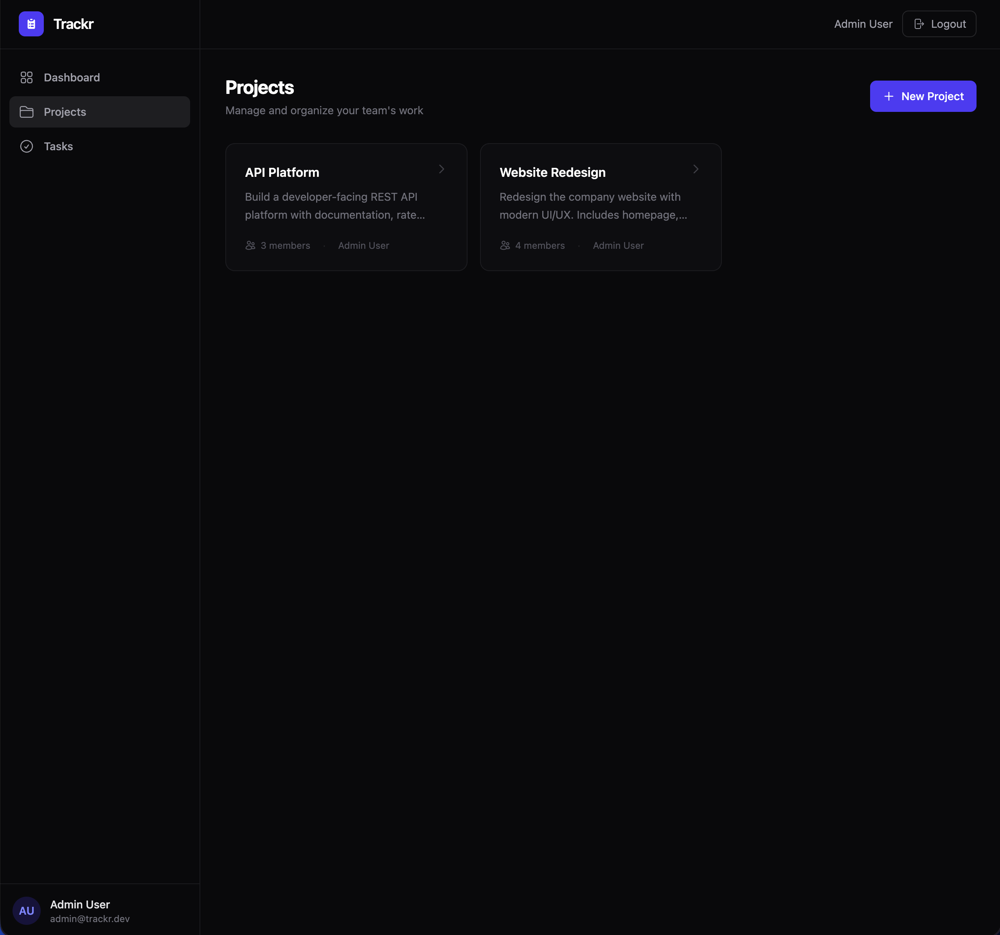
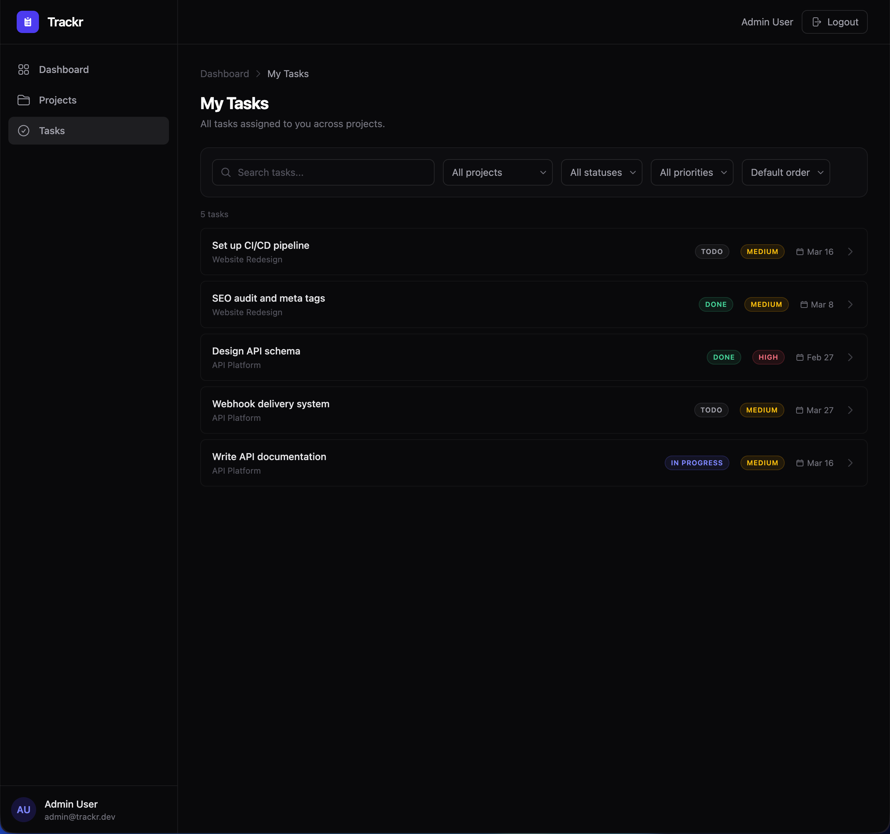
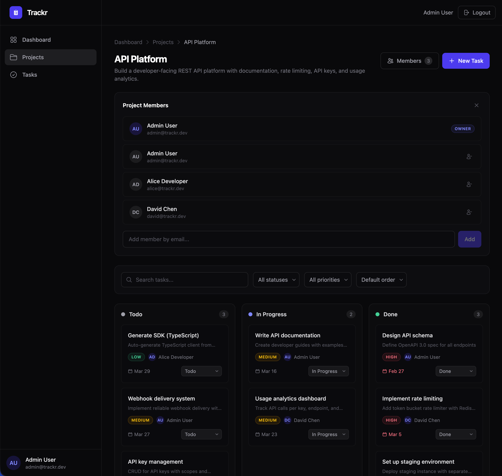
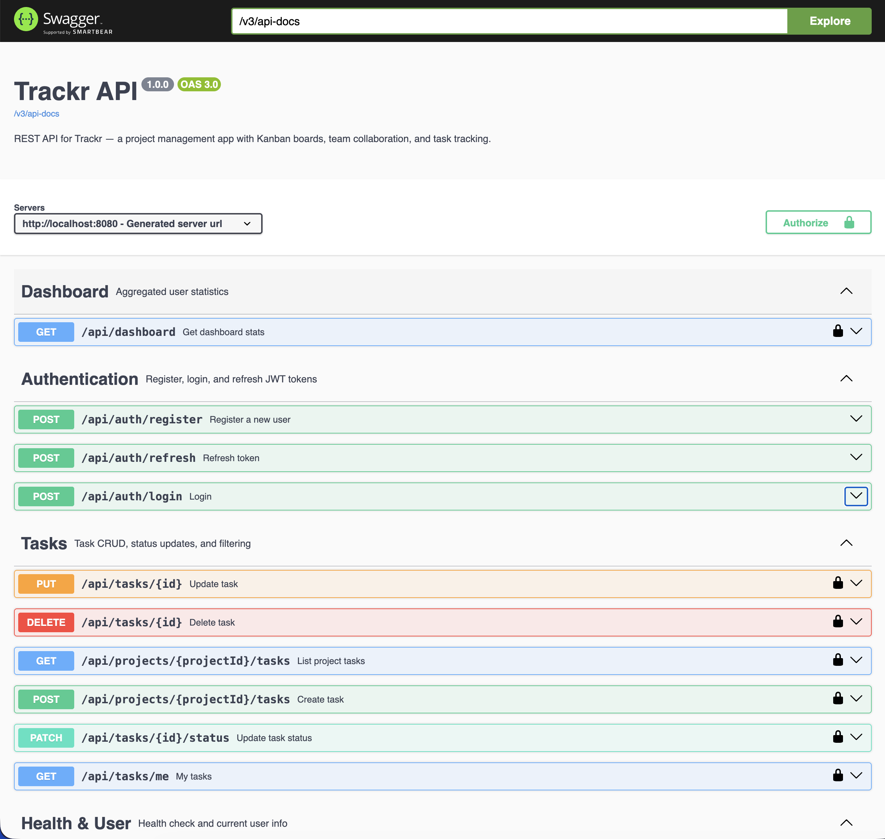

# Trackr

A full-stack project management application with Kanban boards, team collaboration, and task tracking. Built with Angular 21 + Spring Boot 3.

> **Live Demo:** [https://trackr-app.vercel.app](https://trackr-app.vercel.app) · **API Docs:** [https://trackr-api.onrender.com/swagger-ui/index.html](https://trackr-api.onrender.com/swagger-ui/index.html)
>
> *(Update these URLs once deployed)*

<!-- Screenshot: Dashboard view showing task stats cards (todo/in-progress/done counts),
     overdue tasks list, recent activity, and the completion chart.
     Full page with sidebar visible. -->


---

## About

Trackr helps teams organize projects and track tasks through an intuitive Kanban-style interface. Users can create projects, invite team members, assign tasks with priorities and deadlines, and visualize progress through a dashboard with real-time metrics.

### Key Features

- **Authentication** — Register and login with JWT-based auth (access + refresh tokens). Sessions persist securely without re-login.
- **Project Management** — Create projects, invite members by email, and manage team access with owner/member roles.
- **Kanban Board** — Drag-and-drop tasks between columns (To Do, In Progress, Done). Visual indicators for priority and deadlines.
- **My Tasks** — Personal task view with filters by project, status, priority, and search. Paginated for performance.
- **Task Filtering** — Search, filter by status/priority/assignee, and sort by date or priority. All server-side with pagination.
- **Dashboard** — Overview of tasks by status, overdue items, recent activity, and a productivity chart.
- **API Documentation** — Interactive Swagger UI with JWT auth support for testing endpoints.
- **Responsive Design** — Fully usable on desktop, tablet, and mobile. Collapsible sidebar and horizontal-scroll Kanban on small screens.

---

## Screenshots

<!-- Screenshot: Login page with dark theme, email/password fields, "Sign in" button,
     and link to register. Centered card on zinc-950 background. -->
| Login | Register |
|-------|----------|
|  |  |

<!-- Screenshot: Dashboard showing the 4 stat cards at top (tasks by status, overdue,
     active projects, completed last 7 days), overdue task list, recent tasks list,
     and the bar chart. Sidebar should be visible on the left. -->
<!-- Screenshot: Project list showing project cards in a grid, each with name,
     description, owner, member count, and creation date. Include the "New Project"
     button and the create project modal if possible. -->
| Dashboard | Projects |
|-----------|----------|
|  |  |

<!-- Screenshot: Kanban board with 3 columns (Todo, In Progress, Done), task cards
     showing title, priority badge (colored), assignee avatar, due date.
     Show the filter bar above with search, status, priority, and sort dropdowns.
     Ideally show a card being dragged between columns. -->
<!-- Screenshot: My Tasks page with the table/list view showing tasks with project name,
     status badge, priority badge, due date. Filter bar visible at top with project
     dropdown, status, priority filters. -->
| Kanban Board | My Tasks |
|-------------|----------|
|  |  |

<!-- Screenshot: Project detail with members panel open, showing owner and members list,
     "Add member by email" form at the bottom. -->
<!-- Screenshot: Mobile view of the Kanban board showing horizontal scroll with
     one column visible, collapsible sidebar closed. Or mobile view of project list. -->
| Members Panel | Mobile View |
|--------------|-------------|
|  |  |

<!-- Screenshot: Swagger UI showing the API endpoints grouped by tag
     (Authentication, Projects, Tasks, Dashboard), with the JWT auth button visible. -->
| Swagger API Docs |
|-----------------|
|  |

---

## Tech Stack

| Layer | Technology |
|-------|-----------|
| Frontend | Angular 21, TypeScript 5.9, Tailwind CSS 4, CDK Drag & Drop |
| Backend | Java 17, Spring Boot 3, Spring Security, Spring Data JPA |
| Database | PostgreSQL 16 |
| Auth | JWT (access + refresh tokens), BCrypt |
| Docs | SpringDoc OpenAPI 2.3 (Swagger UI) |
| Testing | Vitest (frontend, 95 tests), JUnit 5 + Mockito (backend, 118 tests) |
| CI/CD | GitHub Actions |
| DevOps | Docker, Docker Compose, Nginx |
| Deploy | Vercel (frontend), Render (backend), Supabase (database) |

---

## Architecture

```
┌─────────────────┐         ┌──────────────────────┐         ┌────────────┐
│                 │  HTTP   │                      │   JPA   │            │
│  Angular SPA    │────────▶│  Spring Boot API     │────────▶│ PostgreSQL │
│  (Vercel)       │◀────────│  (Render)            │◀────────│ (Supabase) │
│                 │  JSON   │                      │         │            │
└─────────────────┘         └──────────────────────┘         └────────────┘
                                     │
                            ┌────────┴────────┐
                            │  Spring Security │
                            │  JWT + Rate Limit│
                            └─────────────────┘
```

### Project Structure

```
trackr/
├── backend/
│   ├── src/main/java/com/trackr/
│   │   ├── config/          # Security, CORS, OpenAPI, Rate Limiting
│   │   ├── controller/      # REST controllers (OpenAPI documented)
│   │   ├── dto/             # Request/response objects
│   │   ├── exception/       # Global exception handling
│   │   ├── model/           # JPA entities
│   │   ├── repository/      # Spring Data repositories
│   │   ├── security/        # JWT provider, filter, entry point
│   │   └── service/         # Business logic
│   ├── src/main/resources/
│   │   ├── application.yml       # Base config
│   │   ├── application-dev.yml   # Dev profile (safe defaults)
│   │   └── application-prod.yml  # Prod profile
│   ├── Dockerfile
│   └── pom.xml
├── frontend/
│   ├── src/app/
│   │   ├── core/            # Services, guards, interceptors, models
│   │   ├── features/
│   │   │   ├── auth/        # Login & Register
│   │   │   ├── dashboard/   # Dashboard with stats & charts
│   │   │   ├── projects/    # Project list & Kanban detail
│   │   │   └── tasks/       # My Tasks page
│   │   └── shared/          # Layout, toast, task form modal
│   ├── src/environments/
│   ├── Dockerfile
│   └── nginx.conf
├── .github/workflows/ci.yml  # CI pipeline
├── docker-compose.yml         # Dev environment
├── docker-compose.prod.yml    # Production build
└── .env.example
```

---

## Data Model

```
┌──────────┐       ┌──────────────────┐       ┌──────────┐
│  User    │──────▶│ project_members  │◀──────│ Project  │
│          │  M:N  │ (user_id,        │  M:N  │          │
│ id       │       │  project_id)     │       │ id       │
│ email    │       └──────────────────┘       │ name     │
│ password │                                  │ owner_id │
│ name     │                                  └─────┬────┘
│ role     │                                        │
└─────┬────┘                                        │ 1:N
      │                                             │
      │ assigned_to                           ┌─────┴────┐
      └──────────────────────────────────────▶│  Task    │
                                        N:1   │ id       │
                                              │ title    │
                                              │ status   │  TODO | IN_PROGRESS | DONE
                                              │ priority │  LOW | MEDIUM | HIGH
                                              │ due_date │
                                              └──────────┘
```

---

## Getting Started

### Prerequisites

- [Docker](https://docs.docker.com/get-docker/) and Docker Compose

No need to install Java, Node.js, or PostgreSQL locally.

### 1. Clone and configure

```bash
git clone https://github.com/juandavidperez/Trackr.git
cd Trackr
cp .env.example .env
```

### 2. Start all services

```bash
docker compose up
```

| Service | URL |
|---------|-----|
| Frontend | http://localhost:4200 |
| Backend API | http://localhost:8080 |
| Swagger UI | http://localhost:8080/swagger-ui/index.html |
| PostgreSQL | localhost:5432 |

### 3. Login with seed data

The database is seeded with test users:

| Email | Password | Role |
|-------|----------|------|
| admin@trackr.dev | password123 | Admin |
| alice@trackr.dev | password123 | Member |
| bob@trackr.dev | password123 | Member |

### 4. Stop services

```bash
docker compose down        # Stop containers
docker compose down -v     # Stop and reset database
```

---

## API Endpoints

Full interactive documentation available at `/swagger-ui/index.html`.

| Method | Endpoint | Description | Auth |
|--------|---------|-------------|------|
| POST | `/api/auth/register` | Register a new user | No |
| POST | `/api/auth/login` | Login and receive tokens | No |
| POST | `/api/auth/refresh` | Refresh access token | No |
| GET | `/api/me` | Get current user profile | Yes |
| GET | `/api/health` | Health check | No |
| GET | `/api/dashboard` | Dashboard statistics | Yes |
| GET | `/api/projects` | List user's projects (paginated) | Yes |
| POST | `/api/projects` | Create a project | Yes |
| GET | `/api/projects/:id` | Get project details | Yes |
| PUT | `/api/projects/:id` | Update a project | Owner |
| DELETE | `/api/projects/:id` | Delete a project | Owner |
| GET | `/api/projects/:id/stats` | Project statistics | Yes |
| GET | `/api/projects/:id/members` | List project members | Yes |
| POST | `/api/projects/:id/members` | Add a member by email | Owner |
| DELETE | `/api/projects/:id/members/:userId` | Remove a member | Owner |
| GET | `/api/projects/:id/tasks` | List project tasks (filtered, paginated) | Yes |
| POST | `/api/projects/:id/tasks` | Create a task | Yes |
| GET | `/api/tasks/me` | My assigned tasks (filtered, paginated) | Yes |
| PUT | `/api/tasks/:id` | Update a task | Yes |
| PATCH | `/api/tasks/:id/status` | Change task status | Yes |
| DELETE | `/api/tasks/:id` | Delete a task | Owner |

---

## Testing

```bash
# Backend (118 tests)
docker compose exec backend ./mvnw test

# Frontend (95 tests)
docker compose exec frontend npx ng test --watch=false
```

CI runs automatically on every push and pull request via GitHub Actions.

---

## Environment Variables

| Variable | Description | Default (dev) |
|----------|------------|---------------|
| `POSTGRES_DB` | Database name | `trackr` |
| `POSTGRES_USER` | Database user | `trackr` |
| `POSTGRES_PASSWORD` | Database password | `trackr_dev` |
| `JWT_SECRET` | JWT signing key (min 256-bit) | dev default in `.env.example` |
| `JWT_ACCESS_EXPIRATION` | Access token TTL (ms) | `900000` (15 min) |
| `JWT_REFRESH_EXPIRATION` | Refresh token TTL (ms) | `604800000` (7 days) |
| `CORS_ALLOWED_ORIGINS` | Allowed frontend origins | `http://localhost:4200` |

---

## Technical Decisions

- **Fully Dockerized** — The entire stack runs in containers. Source code is volume-mounted for hot reload in development.
- **JWT with refresh tokens** — Access tokens expire in 15 minutes. Refresh tokens (7 days) allow seamless re-authentication. The Angular interceptor handles refresh transparently.
- **Server-side filtering & pagination** — All task filtering, sorting, and search uses Spring Data Pageable with query parameters. Frontend stays lightweight as data grows.
- **DTOs over entities** — API responses use dedicated DTOs, preventing circular serialization and decoupling the API contract from the database schema.
- **Rate limiting** — Bucket4j token-bucket per client IP (10 req/min for auth, 60 req/min for other endpoints).
- **CDK drag-and-drop with signals** — Kanban columns are hardcoded DOM nodes (not dynamically rendered) to prevent Angular signal re-renders from interfering with CDK's drag state.
- **Spring profiles** — `dev` profile has safe defaults; `prod` profile requires all secrets via environment variables.

---

## License

This project is for portfolio and educational purposes.
